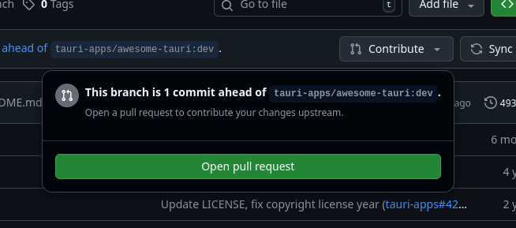

# Contributing

- Get a fork of the project if you haven't already
- Check that there aren't any mistakes (github is set-up to check when you do
  a pull request also) using `npm run lint`, you can try to fix them automatically
  with `npm run lint:fix` if there are
- Make sure to commit and push all changes to github!
- Go back to github (page of your fork) and try to sync your fork (image below)
  
- If there are any conflicts you can try to solve them on your own or ask for help
- Once there are no conflicts do a pull request (image below)
  
- Write what you did and check the changes if there is something unnecessary, try
  to follow [Conventional Commits](https://www.conventionalcommits.org)
- Once sure press `Create pull request`
