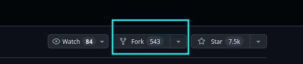

# Jail management system

System for managing jails and it's tenants

## Basic structure

```
root
|
+-- backend         # Contains the backend stuff
|
+-- frontend        # Contains the frontend stuff
|
+-- shared          # Contains code used in both frontend and backend
```

## Some info

- Some folders contain `README.md` file which contains explanation and example
  usage of the folders inside it
- Work on a single feature, when you are finished with that push the changes
  and work on something else, if you want to work on multiple features create
  different branches, I am pretty sure this was requirement from the teacher
  but correct me if I am wrong
- Follow [Conventional Commits](https://www.conventionalcommits.org)
  From what I remember the teacher required and it takes like 5 minutes to
  learn it!

[Frontend README](/frontend/README.md)
[Backend README](/backend/README.md)
[CONTRIBUTING.md](./CONTRIBUTING.md)

## Getting started

- Go to the [github page of the project](https://github.com/d-najd/sweden-fullstack-group-project)
- Create a fork as shown in the image below
  
- Clone the repo using `git clone https://github.com/your-username/your-fork.git`
- Install [mysql](mysql.com)
- Setup `.env` - you can use [.env.example](./.env.example), if not setup the
  values of [.env.example](./.env.example)
  have been set but I doubt you have the database and user as defined there
- Setup the [mysql](https://mysql.com) database with the settings from the
  `.env` file
- Run `npm ci` to install dependencies
- Run `npm run dev` to run both frontend and backend or `npm run dev:frontend` just
  for frontend or `npm run dev:backend`, you can see the other available commands
  in `package.json`
